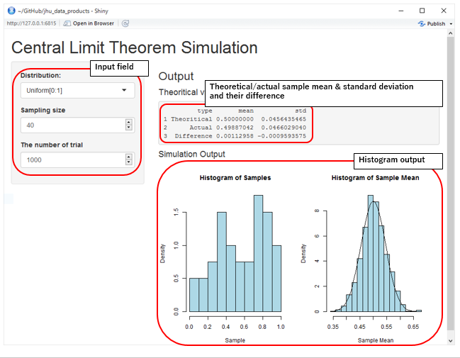

## Central Limit Theorem

<a href="https://en.wikipedia.org/wiki/Central_limit_theorem">Wikipedia</a>

<font size="4" color="#800000"><i> In probability theory, the central limit theorem (CLT) states that, given certain conditions, the arithmetic mean of a sufficiently large number of iterates of independent random variables, each with a well-defined expected value and well-defined variance, will be approximately normally distributed, <u><b>regardless of the underlying distribution</b></u>." </i></font>

<font size="4">Let ${X_1, \cdots, X_n}$ be a random sample of size $n$ - that is, a sequence of independent and identically distributed random variables drawn from distributions of expected values given by $\mu$ and finite variances given by $\sigma^2$. Suppose we are interested in the sample average

$S_n := \frac{X_1+\cdots+X_n}{n}$

of these random variables. For large enough $n$, the distribution of $S_n$ is close to <u><b>the normal distribution</b></u> with <u><b>mean $\mu$ </b></u>and <u><b>variance 
$\frac{\sigma^2}{n}$ </b></u></font>

--- .class #id

## Central Limit Theorem Simulation Application
<ol>
<li><font size="4">We can learn about the theorem with playing this application</font></li>
<li><font size="4">We can adjust sample size and the number of trials</font></li>
<li><font size="4">We can choose from 4 different distribution types</font></li>
</ol>


```r
set.seed(300)
par(mfrow=c(1,4))
hist(runif(100), 10, xlab="Sample",col="lightblue",main="Uniform Distribution", probability = TRUE)
hist(rnorm(100), 10, xlab="Sample",col="lightblue",main="Normal Distribution", probability = TRUE)
hist(rpois(100,4.0), 10, xlab="Sample",col="lightblue",main="Poisson Distribution", probability = TRUE)
hist(rexp(100), 10, xlab="Sample",col="lightblue",main="Exponential Distribution", probability = TRUE)
```


</font>

--- .class #id

## Application Screenshot
<div align="center"></img></div>

--- .class #id 

## URL
<li><a href="https://yappon.shinyapps.io/jhu_data_products/">Central Limit Theorem Simulation Application</a></li>
<li><a href="https://github.com/yappon/jhu_data_products/wiki/Central-Limit-Theorem-Simulation-Application">Help page for this application</a></li>
<li><a href="https://github.com/yappon/jhu_data_products/">GitHub repository for this application</a></li>


